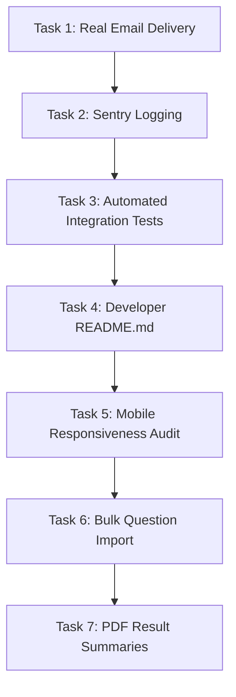

# Implementation Plan & Roadmap

This document outlines the milestones completed during the development of Phases 1 to 3, and details the execution roadmap for Phase 4.

---

## 1. Completed Milestones (Phases 1-3)

### Phase 1: Core Portal Structure (Completed)
* [x] Initialize Next.js 16 project structure with App Router.
* [x] Set up database schema in Prisma and configure PostgreSQL connection with Supabase.
* [x] Set up Next-Auth v5 credentials-based authentication.
* [x] Implement custom middleware proxy gate (`proxy.ts`) to enforce role-based access.
* [x] Build Admin User Management & Audit Log dashboards.
* [x] Build Teacher Course & Quiz Scheduling workspaces.
* [x] Build Student Assessment Dashboards.

### Phase 2: Telemetry & Real-Time Tracking (Completed)
* [x] Implement the interactive student `QuizRunner.tsx` with scheduled entry gates.
* [x] Configure active quiz countdown timer.
* [x] Build the client-side debounced autosave action (1000ms + `onBlur`).
* [x] Build browser focus telemetry hooks for tab switch monitoring.
* [x] Implement the Teacher Live Progress Tracking dashboard (2s polling interval).

### Phase 3: Database & Security Hardening (Completed)
* [x] Implement attempt session locking (`activeSessionToken` checks).
* [x] Integrate session invalidation via `tokenVersion` increments on password change.
* [x] Configure point-lookup JWT validation cache (60s TTL).
* [x] Add database performance indexes to `QuizAttempt` and `AuditLog`.
* [x] Set up Supabase Storage configuration and create Server Actions for file uploads/deletions.
* [x] Lock down database connections using `connection_limit=2`.
* [x] Build rest test endpoint `/api/test/quiz-flow` and test harness `load-test.js` to simulate 60 concurrent VUs.

---

## 2. Phase 4 Execution Roadmap (Not Started)
The incoming team should execute Phase 4 tasks in the following order:

### Task 1: Real Email Delivery (Password Reset)
* **Goal**: Replace the current console logging simulator with real email delivery.
* **Steps**:
  1. Set up account credentials on Resend / SendGrid / SMTP.
  2. Install Nodemailer or the vendor SDK.
  3. Update `requestPasswordResetAction` in `src/app/(auth)/forgot-password/actions.ts` to dispatch an HTML email.

### Task 2: Runtime Error Monitoring (Sentry Integration)
* **Goal**: Set up exception monitoring and tracing.
* **Steps**:
  1. Create a Sentry.io project.
  2. Run `npx @sentry/nextjs --init` locally.
  3. Add the `SENTRY_DSN` env variable to Vercel and verify error capturing on mock throws.

### Task 3: Automated E2E Tests (Playwright / Cypress)
* **Goal**: Build an automated verification suite for core workflows.
* **Steps**:
  1. Install Playwright (`npm init playwright@latest`).
  2. Write automated test scripts for user login, telemetry updates, autosave updates, and quiz grading validations.

### Task 4: Developer Guidelines & README
* **Goal**: Write a professional repository guide.
* **Steps**:
  1. Author a root `README.md` detailing startup, testing scripts, and Prisma management guidelines.

### Task 5: Mobile Responsive Layouts Audit
* **Goal**: Adapt dashboards and quiz taker layout to mobile screen constraints.
* **Steps**:
  1. Verify visual behaviors on viewport widths < 768px.
  2. Update navigation sidebar structures to collapsible hamburger viewports.
  3. Ensure quiz workspace layouts prevent content truncation.

### Task 6: Teacher Bulk Question Import
* **Goal**: Enable teachers to import questions in bulk from Excel or CSV templates.
* **Steps**:
  1. Implement a CSV parser inside `src/app/(teacher)/teacher/actions.ts`.
  2. Validate input schemas against Zod structures.
  3. Execute bulk database inserts using `prisma.question.createMany`.

### Task 7: Exportable PDF Score Summaries
* **Goal**: Generate printable PDF scorecard summaries.
* **Steps**:
  1. Integrate `@react-pdf/renderer` or serverless PDF rendering libraries.
  2. Add a scorecard download trigger to the student dashboard.
